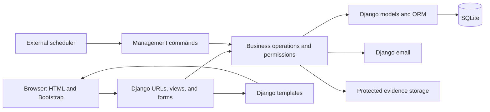

# Household chores MVP architecture

Status: selected architecture for implementation; only the Django scaffold currently exists.

The [product specification](plan.md) defines behavior, scope, and priorities: P0, then P1, then P2. This document records the selected Option 1 architecture and does not add product requirements or prescribe a task sequence. Implementation work will be planned separately.

## Stack and rationale

| Area | Decision | Reason |
|---|---|---|
| Language and dependencies | Python 3.14, uv, committed `uv.lock` | Continue the existing setup with reproducible dependencies. |
| Web framework | Django 5.2 LTS | Keep forms, authentication, persistence, and rendering in one application. |
| Frontend | Django templates and forms, Bootstrap | Support responsive task lists, forms, review screens, and calendars with a small frontend toolchain. |
| Database | SQLite for the initial MVP | Run locally without a database service. |
| Authentication | Django sessions, email/password, invitation-based member signup | Use the specification's email/password option. |
| Email | Django email, console backend locally, SMTP when deployed | Support invitations and password recovery. |
| Scheduled work | Django management commands invoked by an external scheduler | Process recurring occurrences, overdue tasks, and reminders without requiring browser visits. |
| Evidence photos | Django file handling and local media storage initially | Support one optional image per completion submission in P2. |
| Tests | Django test runner and test client | Verify business rules, permissions, forms, and database effects. |

Bootstrap, product authentication flows, scheduled commands, and photo handling are planned, not implemented. No React, separate REST API, HTMX, Node build pipeline, Redis, or Celery is required for this architecture.

## Application structure

Use a single Django application deployment with these responsibilities:

- `config/`: project settings, root URL routing, and WSGI/ASGI entry points.
- `chores/`: household product models, migrations, URLs, views, forms, templates, static assets, and tests.
- `chores/services.py` or a small services package, introduced when needed: shared operations such as submission, approval, reassignment, and recurrence generation.
- `chores/management/commands/`, introduced in P1/P2: scheduled processing entry points that call the same business operations as web requests where applicable.
- `manage.py`: development and management entry point.

Keep the existing `chores` app until actual implementation warrants splitting it. Add files and models incrementally as the corresponding features are implemented.

Views authenticate the request, retrieve household-scoped records, validate forms, and invoke the appropriate operation. Templates render the result. Successful form submissions redirect to a page to avoid accidental browser resubmission. State-changing requests use POST and Django CSRF protection.

Ordinary full-page navigation is sufficient for the MVP, including calendar day/week/month views. Django admin remains a development/maintenance tool; the product administrator uses the product's own screens and permissions.

## Identity and access

Use Django authentication facilities for password hashing, sessions, login/logout, and password recovery. Finalize the user model and email login strategy before product migrations. The existing scaffold currently uses Django's default user model; changing that later requires an explicit migration approach that preserves existing data.

Household roles are product roles, separate from Django staff/superuser privileges:

- An administrator manages one household and controls invitations, tasks, membership, and reviews.
- A member joins only through an email invitation and cannot have simultaneous active memberships in different households.
- Only the administrator removes a member; removal deactivates access while preserving historical records.
- Active household members can read household tasks. Only the responsible member and administrator can perform the actions allowed by the specification.

Check authorization on the server for every read and write, including submitted IDs and evidence downloads. Hiding a button is not an authorization check. Member access to a task does not imply permission to edit all its fields.

## Data and business rules

Use Django models, migrations, relational constraints, and short database transactions. Introduce the conceptual entities incrementally:

| Phase | Data introduced |
|---|---|
| P0 | User strategy, Household, HouseholdMember, invitation records, Task, TaskCompletion, TaskHistory |
| P1 | Category, priority/deadline fields, recurring task definitions and occurrence relationships |
| P2 | Task point values and frozen completion awards, Comment, evidence attachment, SwapRequest, Notification |

Rankings are derived from approved completion awards. The dashboard and calendar are views of existing data rather than separate sources of truth.

Core invariants:

- Submission moves a Pending or Overdue task to Awaiting approval. Only administrator approval makes it Completed.
- Rejection requires a reason and returns the task to Pending or, once deadlines exist, Overdue when its deadline has passed.
- Task changes and their history entries commit together. History records actor, time, and relevant old/new values.
- Preserve separate submissions and reviews so rejection and resubmission do not overwrite evidence or decisions.
- Completed tasks are never physically deleted. Use cancellation for the MVP's removal flow and retain history.
- Each recurring occurrence is its own task. Definition changes affect future generation without rewriting previous occurrences.
- Approval records the credited responsible member and awarded points once. Later reassignment or point edits must not change historical awards.
- Weekly, monthly, and overall rankings use approved awards, with the specification's task-count tie-break and shared positions.

Use uniqueness constraints and conditional state updates alongside transactions to prevent duplicate occurrences, reviews, and awards. A transaction alone does not make repeated requests safe. Keep the initial design compatible with SQLite rather than relying on database locking features it does not provide.

## Scheduled processing and time

Introduce scheduling alongside the features that require it, following the specification's priorities:

- P1: generate recurring occurrences and mark eligible outstanding tasks overdue.
- P2: generate internal reminders when eligible tasks enter the 24-hour deadline window; tasks due less than 24 hours after creation receive only assignment notifications.

Run commands through Windows Task Scheduler locally or the deployment platform's scheduler later. Document frequency, invocation, and how to inspect failures. Commands must tolerate retries and missed runs without creating duplicate records; avoid overlapping runs in the initial setup.

Use timezone-aware datetimes consistently. The scaffold currently uses UTC. Choose and document the display/scheduling timezone, week boundaries, and monthly recurrence day handling when implementing P1; use the same rules for deadlines, calendars, reminders, and rankings.

Assignment notifications are stored during assignment operations, including recurring occurrence generation. Internal notification pages do not require WebSockets or push infrastructure.

## Email, static assets, and evidence

Invitations and password recovery use email even though task notifications are internal. The console email backend supports local testing; configure SMTP through environment settings when real delivery is needed.

Serve Bootstrap and application styling as static assets. Keep uploaded evidence separate from static files. In P2, validate image type and size, allow at most one image per submission, and enforce household access when retrieving it. Local media needs persistent storage and backups if used in a deployed environment.

## Development and deployment boundaries

The existing development workflow remains:

1. `uv sync --locked`
2. `uv run python manage.py migrate`
3. `uv run python manage.py runserver`

Keep `.venv`, local SQLite data, credentials, and future uploaded evidence out of version control. Commit migrations and the dependency lockfile.

No hosting provider is selected yet. A deployed version will need a production WSGI/ASGI server, environment-provided secrets, appropriate host/HTTPS settings, static asset serving, persistent database/media storage, backups, and the scheduled commands. The generated debug settings and development server are for local use.

SQLite remains the initial database choice. Revisit PostgreSQL if concurrent writes or deployment requirements justify it; that would require a separate architecture decision, migration, and validation.

## Verification and scope

Add focused Django tests with each behavior, especially household isolation, membership removal, task transitions, repeated approval requests, historical preservation, recurrence retries, and time boundaries. Finish with the specification's full administrator/member journey.

The specification prioritizes the P0 essential workflow, followed by P1 organization and P2 engagement. Required rejection reasons belong to P0; optional comments and photos belong to P2. These priorities guide scope; individual implementation steps will be defined separately.

The exclusions in specification section 20 remain in force. Social login, frontend architecture changes, and additional infrastructure are not part of the selected initial implementation.
